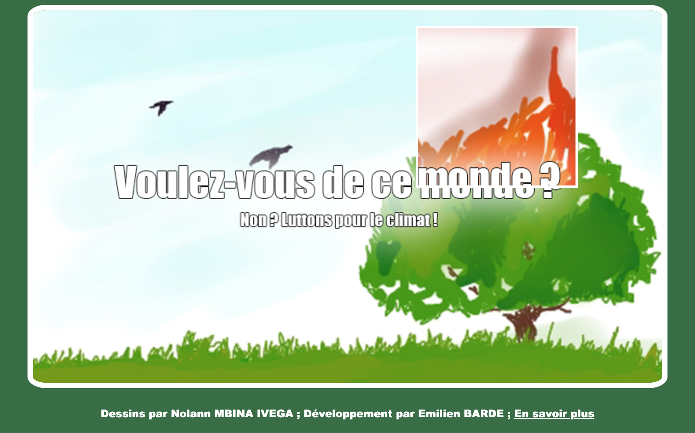

# 📖 Présentation
J'ai réalisé ce projet pour notre collège avec [**Nolann MBINA IVEGA**](https://github.com/Emilien-B/Climat#-cr%C3%A9dits) qui a fait les dessins. 

Le site a pour but de sensibiliser sur les conséquences du changement climatique.
En passant la souris sur le paysage paradisiaque, vous découvrirez un paysage apocalyptique du futur.

# 🖥 Utilisation

Vous pouvez consulter le site sur [**emilien-b.github.io/climat**](https://emilien-b.github.io/Climat/).

>Vous pouvez aussi [**télécharger les fichiers**](https://github.com/Emilien-B/Climat/archive/refs/heads/main.zip) de la page et **lancer `index.html`**.

### ⚠️ Le site n'est pas disponible sur mobile.

# 📝 Crédits

Dessins par [**Nolann MBINA IVEGA**](https://www.instagram.com/chizunokichichi/)

Développement par [**Emilien BARDE**](https://twitter.com/by_emilienb) (moi)

Sur la base d'un code de [**Amirouche HALFAOUI**](https://github.com/amihalfa)
